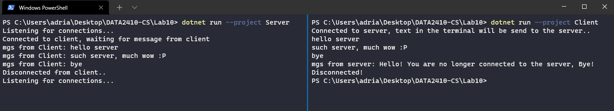

# Lab 10 Exercise (simple TCP server and client)

Created with .NET 6, C#10. Dotnet can be downloaded [here](https://dotnet.microsoft.com/en-us/download). (It also comes bundled with Visual Studio). You can test if you have .NET 6 by doing: `dotnet --version` in the terminal(you should then see `6.0.102` in the console).

## Setup

There are 2 projects in the Lab10 solution, everything is located in the [Lab10](https://github.com/s341507/DATA2410-Csharp/tree/main/Lab10) folder.

The main files are the Server [Program.cs](https://github.com/s341507/DATA2410-Csharp/blob/main/Lab10/Server/Program.cs):

And Client [Program.cs](https://github.com/s341507/DATA2410-Csharp/blob/main/Lab10/Client/Program.cs):

## Testing

To run the Server, you can either run it from an IDE or simply use: `dotnet run --project Server`.

To run the Client simply change to the client project instead of the server project. Example `dotnet run --project Client`

Here is an example of how it works:

