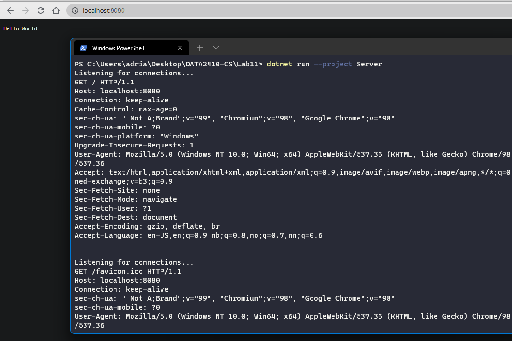

# Lab 11 Exercise (TCP Socket to Implement HTTP Server)

Created with .NET 6, C#10. Dotnet can be downloaded [here](https://dotnet.microsoft.com/en-us/download) (It also comes bundled with Visual Studio). You can test if you have .NET 6 by doing: `dotnet --version` in the terminal (you should then see `6.0.102` in the console).

## Setup

The [TCP/HTTP Server](https://github.com/s341507/DATA2410-Csharp/blob/main/Lab11/Server/Program.cs), is setup to listen for `localhost` at port `8080`. Then when a client connects we receive the HTTP Request and send our simple **Hello World** responce to the client.

## Testing

To run the [TCP/HTTP Server](https://github.com/s341507/DATA2410-Csharp/blob/main/Lab11/Server/Program.cs), you can either run it from an IDE or simply use: `dotnet run --project Server`. Then use a browser/terminal to connect to `localhost:8080`.

Here is an example of how it works:

