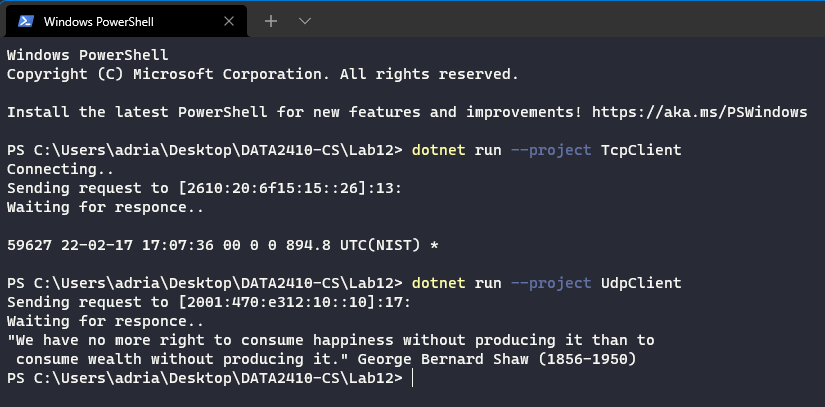

# Lab 12 Exercise (TCP and UDP Sockets)

Created with .NET 6, C#10. Dotnet can be downloaded [here](https://dotnet.microsoft.com/en-us/download). (It also comes bundled with Visual Studio). You can test if you have .NET 6 by doing: `dotnet --version` in the terminal(you should then see `6.0.102` in the console).

## Testing

To run the UDP Client, you can either run it from an IDE or simply use: `dotnet run --project UdpClient`.

To run the TCP Client simply change to the client project instead of the server project. Example `dotnet run --project TcpClient`

Here is an example of how it works:

