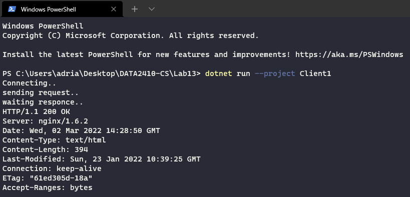
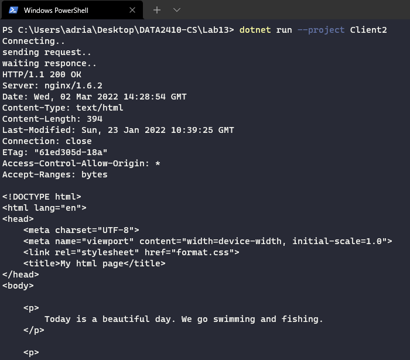

# Lab 13 Exercise (More TCP/HTTP Sockets)

Created with .NET 6, C#10. Dotnet can be downloaded [here](https://dotnet.microsoft.com/en-us/download) (It also comes bundled with Visual Studio). You can test if you have .NET 6 by doing: `dotnet --version` in the terminal (you should then see `6.0.102` in the console).

## Setup

[HTTP Echo Server](https://github.com/s341507/DATA2410-Csharp/blob/main/Lab11/EchoServer/Program.cs), setup to just with a pre/processor to make it async or not. Simply uncommenting the `#define async` to make the server not be asynchronous.

There is also a [HTTP Echo Client](https://github.com/s341507/DATA2410-Csharp/blob/main/Lab11/EchoClient/Program.cs), but it's better to use tools like ... to actually profile the asynchronous vs synchronous performance differences.

## Testing

Here's the 2 first tasks with examples:

[HTTP Request 1](https://github.com/s341507/DATA2410-Csharp/blob/main/Lab13/Client1/Program.cs)

[HTTP Request 2](https://github.com/s341507/DATA2410-Csharp/blob/main/Lab13/Client2/Program.cs)

