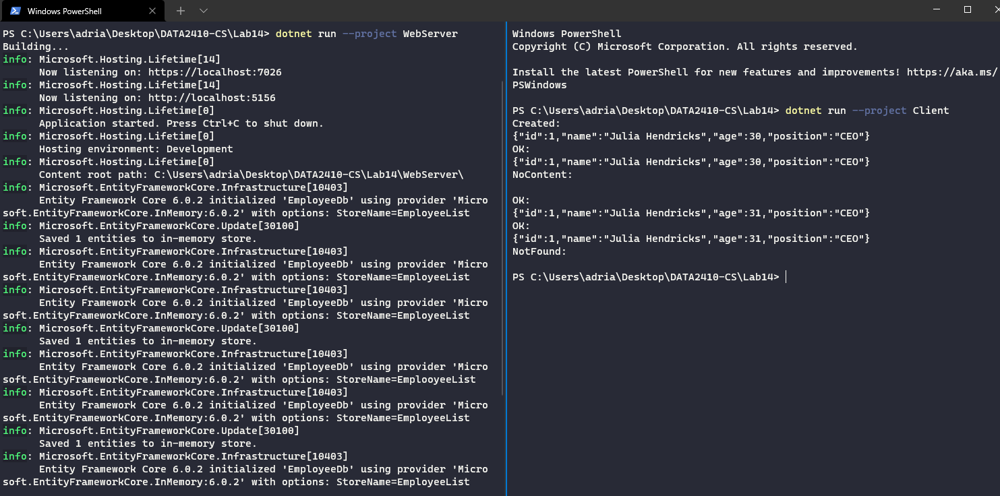

# Lab 14 Exercise (A simple REST API)

Created with .NET 6, C#10. Dotnet can be downloaded [here](https://dotnet.microsoft.com/en-us/download) (It also comes bundled with Visual Studio). You can test if you have .NET 6 by doing: `dotnet --version` in the terminal (you should then see `6.0.201` in the console).

## Setup

The [REST Server](https://github.com/s341507/DATA2410-Csharp/blob/main/Lab14/WebServer/Program.cs), is setup on `localhost:7026/employee/{id}` to use `GET`, `POST`, `PUT` and `DELETE` requests to that route.

## Testing

To run the [REST Server](https://github.com/s341507/DATA2410-Csharp/blob/main/Lab14/WebServer/Program.cs) and then use any client to send the HTTP (GET, POST, PUT, DELETE..) requests [HTTP Client](https://github.com/s341507/DATA2410-Csharp/blob/main/Lab14/Client/Program.cs).

Which can be run in the terminal like this:

